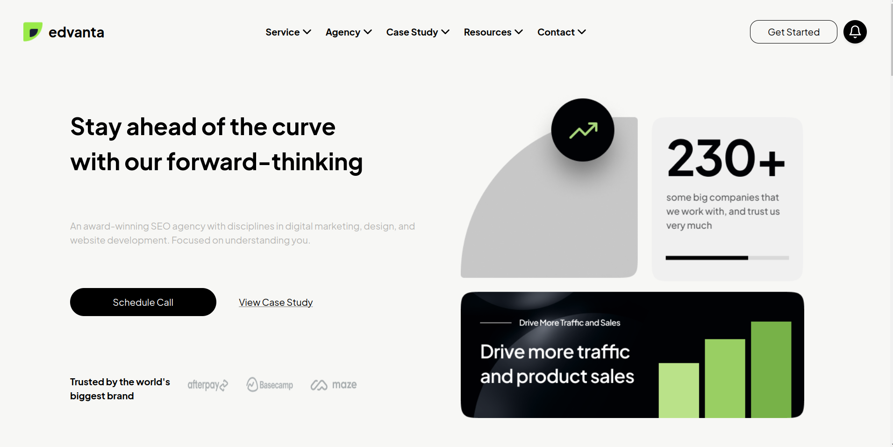
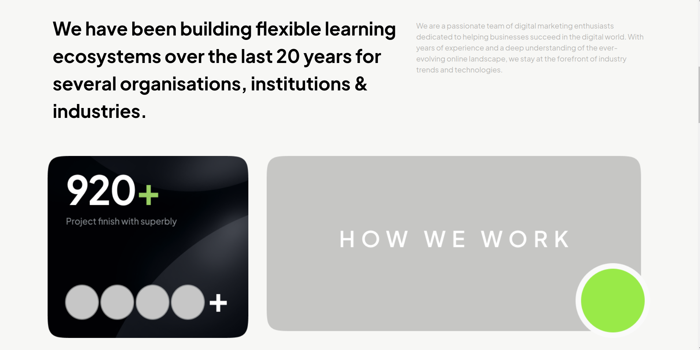
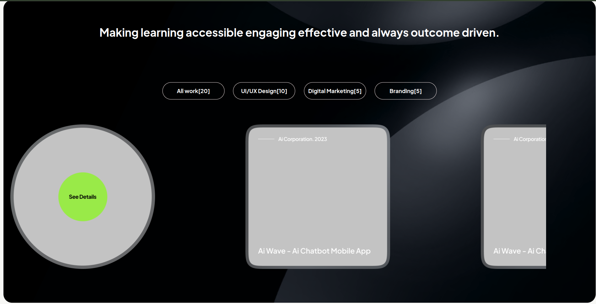
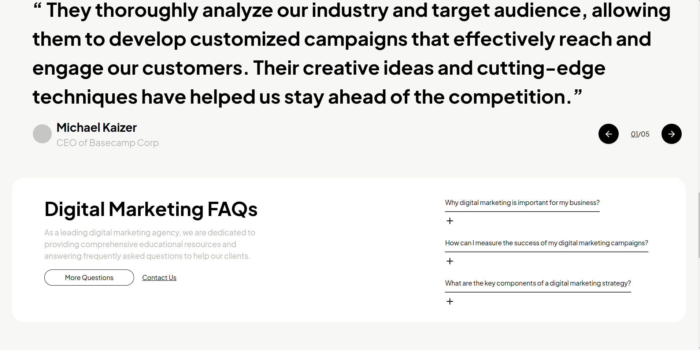
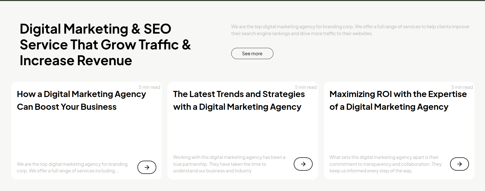
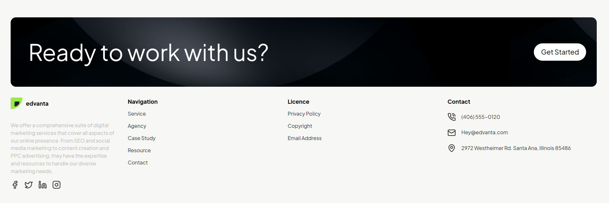

# Vue 3 + Vite

# Vue Landing Page Project

Welcome to the Edvanta Technologies Landing Page Project! This project is a modern, responsive landing page built using Vue.js and Vite. 

## Project Overview

This project serves as a showcase landing page for a company. It highlights various sections of the business and provides a clean, user-friendly interface. 

## Technologies Used

This project leverages the following technologies:

- **HTML**: The standard markup language used for structuring the content on the web.
- **CSS**: The stylesheet language used for styling and layout of the web page.
- **Vue.js**: A progressive JavaScript framework used for building user interfaces and single-page applications.
- **Vite**: A fast build tool that provides a smooth development experience with hot module replacement.

### Icons

For icons, we utilize the [Lucide library](https://lucide.dev/), which provides a comprehensive set of high-quality SVG icons.


### Landing Page Overview
#Navbar and Intro Section:

#Services Section:


#Example Section:


#Digital Marketting Info Section:


#More Info Section:


#Footer Section:

## Getting Started

To get started with this project, follow the steps below:

1. **Clone the Repository**

   ```bash
   git clone https://github.com/yourusername/your-repo.git
   cd your-repo
2. **Install Dependencies**

   ```bash
   npm install
1. **Start the Development Server**

   ```bash
   npm run dev
